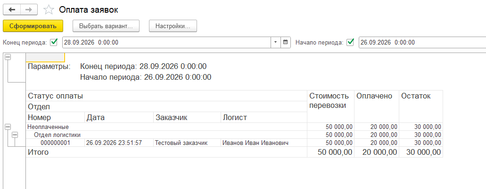

# Управление логистикой на 1С

Тестовый проект по автоматизации грузоперевозок: оформление заявки, передача в «Бухгалтерию предприятия», создание счёта и возврат сведений об оплатах. Решение включает самостоятельную конфигурацию, расширение Бухгалтерии и двусторонний обмен JSON через отдельные обработки.

Вариант задания **0293-01**: обмен JSON и отчёт по оплатам на СКД. Основной сценарий проверен вручную в учебных базах. **Остаётся расхождение с Приложением 2:** пять реквизитов в расширении хранят представления справочников строками вместо ссылок. Подробности — в [сверке с заданием](docs/requirements.md).



## Что реализовано

- Заявка: заказчик, договор, логист, отдел, маршрут, водитель, транспорт, стоимость и сроки оплаты.
- Расчёт сумм без НДС, разницы стоимости и суммы исполнителя, оплаты и остатка; проверка дат маршрута и владельца договора.
- Учёт бухгалтерских документов, оплат, почтовых отправлений и работы с задолженностью.
- Расширение Бухгалтерии: заявка, создание счёта на её основании и явная связь счёта с заявкой.
- Передача заявки и возврат связанных счетов и проведённых банковских поступлений через JSON.
- Отчёт СКД «Оплата заявок»: период по дате заявки, группировка по оплате и отделу, суммы и остаток.

## Как устроен обмен

| База | Обработка | Назначение |
|---|---|---|
| Управление логистикой | `ОбменJSON` | Выгрузить заявку и загрузить ответ Бухгалтерии |
| Бухгалтерия + расширение «ЛогистикаОбмен» | `ЛГ_ОбменJSON` | Загрузить заявку, обновить оплаты и выгрузить ответ |

Документы связываются по UUID. В Бухгалтерии пользователь заранее создаёт заявку и выбирает организацию, контрагента и договор. Счёт связан с ней реквизитом `ЛГ_ЗаявкаОснование`. Оплаты выбираются из расшифровки проведённых банковских поступлений по связанным счетам.

Обратный файл содержит полный набор счетов и оплат. При загрузке он заменяет предыдущие строки: повторный импорт не увеличивает суммы, а отмена проведения платежа учитывается после нового обмена. Перед записью проверяются принадлежность ответа заявке, дата пакета, идентификаторы и арифметика.

## Как посмотреть проект

1. [Установить конфигурацию и расширение](docs/installation.md) в две учебные базы.
2. [Создать демонстрационные данные и пройти обмен](docs/user-guide.md).
3. Показать частичную оплату **20 000 / остаток 30 000**, полную **50 000 / 0**, затем отмену второго платежа.
4. Повторно загрузить один ответ и проверить отсутствие дублей.
5. Сформировать отчёт «Оплата заявок» за период, включающий дату заявки.

Последняя ручная проверка — **28.09.2026**: заполнение/очистка отдела, сохранение телефона и email, обмен через обработки и повторная загрузка ответа. Полная оплата и отмена проведения проверялись ранее в этих же учебных базах. [Результаты, скриншоты и оставшиеся проверки](docs/testing.md).

Развёртывание опубликованного комплекта с нуля в новой паре баз пока отдельно не подтверждено. Структурная проверка XML/JSON проходит; компиляцию BSL она не заменяет.

## Окружение и исходники

| Компонент | Версия / путь |
|---|---|
| Платформа | 1С:Предприятие, учебная версия 8.3.27.1508 |
| Бухгалтерия | Бухгалтерия предприятия (учебная), 3.0.67.54 |
| Режим | Windows, файловые базы, управляемое приложение |
| Конфигурация логистики | `src/logistics` |
| Расширение Бухгалтерии | `src/bp-extension` |
| Примеры JSON с вымышленными данными | `examples` |

Исходники представлены иерархической выгрузкой XML и модулями BSL. Платформа, типовая Бухгалтерия и заполненные базы устанавливаются отдельно. JSON-примеры привязаны к исходным UUID; в новой паре баз обменные файлы формируются заново.

## Документация

- [Соответствие заданию](docs/requirements.md).
- [Архитектурные решения и ход разработки](docs/development.md).
- [Формат JSON](docs/json-format.md).
- [Проверки и результаты](docs/testing.md).

## Ограничения

- Пять справочных реквизитов в расширении пока представлены строками; справочники полностью не синхронизируются.
- Обмен ручной, для одной выбранной сохранённой заявки. Учитываются счета и банковские поступления; касса, возвраты и реализации не реализованы.
- Отчёт показывает текущую оплату заявок выбранного периода. Историческая задолженность на конец периода не рассчитывается.
- Обновление заменяет строки оплат и бухгалтерских документов, включая введённые вручную.
- Роли, параллельный обмен, другие релизы Бухгалтерии и серверный режим отдельно не проверены.

## Проверка структуры

При установленном Python 3, из корня репозитория:

```console
python tools/check_project.py
```

Проверяются XML, привязки обработчиков форм, JSON-примеры и локальные ссылки. Для проверки поведения необходим запуск в 1С.

## Работа над проектом

Автор настраивал конфигурации в 1С, воспроизводил ошибки и выполнял ручные проверки. ChatGPT/Codex использовался при проектировании, подготовке кода, разборе ошибок и оформлении документации. Технические решения и ограничения описаны в [истории разработки](docs/development.md).
