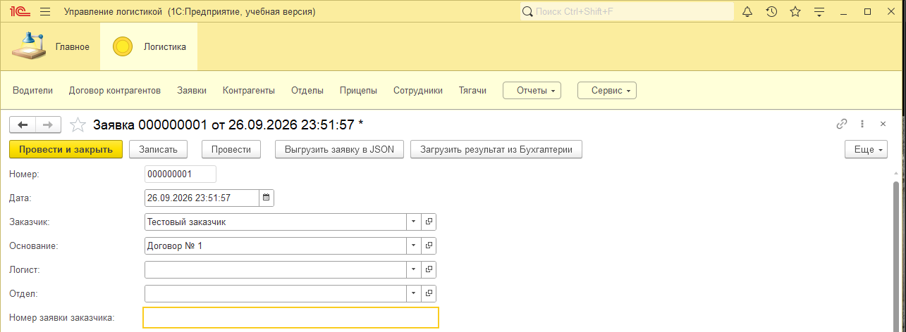
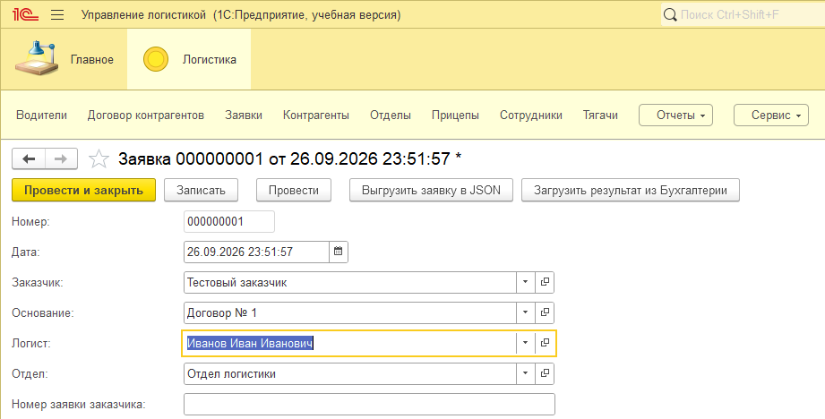
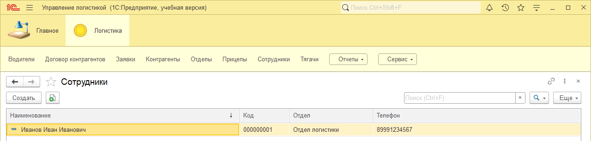
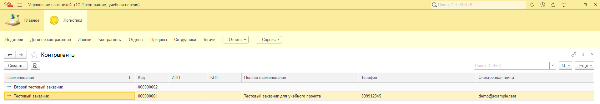
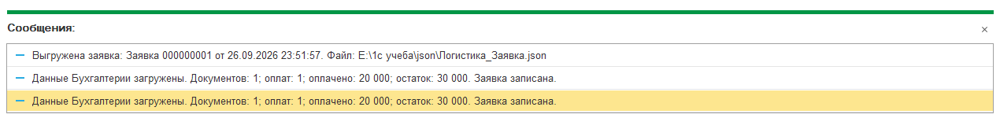
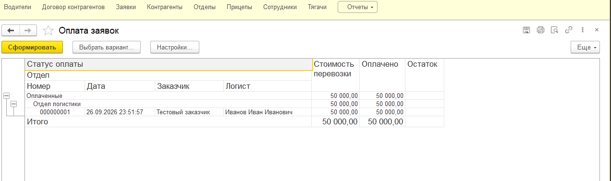
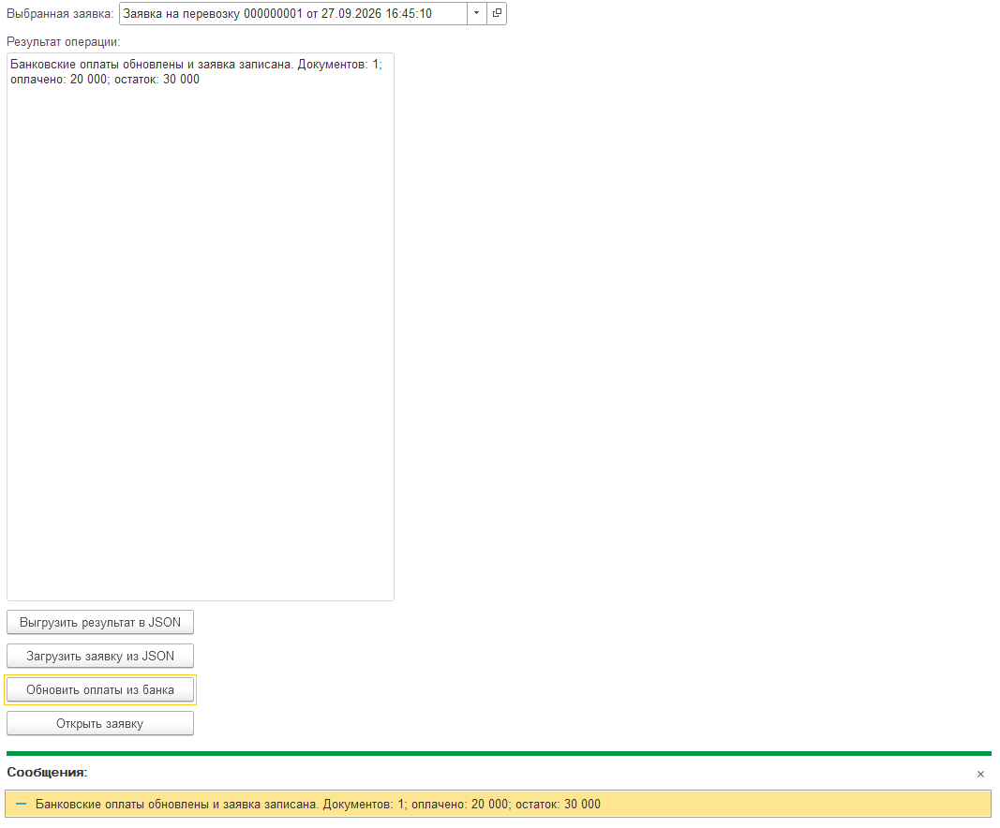

# Тестирование

Проверки выполнены автором в учебных базах на платформе 8.3.27.1508 и Бухгалтерии 3.0.67.54. Результаты подтверждены сообщениями программы и скриншотами. Структурные проверки выполнены отдельно, без запуска 1С.

## Последний контрольный прогон — 28.09.2026

После применения трёх исправлений из [истории исправлений](prepublication.md) проверены:

| Проверка | Фактический результат |
|---|---|
| Очистка логиста | Поле отдела тоже очищено |
| Выбор Иванова Ивана Ивановича | Заполнен «Отдел логистики» |
| Телефон сотрудника | Значение сохраняется и отображается в списке |
| Электронная почта контрагента | `demo@example.test` сохраняется целиком |
| Прямой обмен через обработку | Заявка загружена в Бухгалтерию и записана |
| Обновление банковских оплат | 1 документ оплаты, оплачено 20 000, остаток 30 000 |
| Обратный обмен | В логистику загружены 1 счёт и 1 оплата; заявка записана |
| Повторная загрузка того же ответа | Снова 1 счёт, 1 оплата, 20 000 / 30 000; сообщения не показывают роста строк или сумм |











Выбор второго сотрудника из другого отдела и повторное открытие всей базы после перезапуска в этом прогоне отдельно не зафиксированы. Скриншоты не заменяют полный протокол проверки конфигурации в Конфигураторе.

## Проверено ранее в тех же учебных базах

| Сценарий | Результат |
|---|---|
| Создание счёта из заявки | Счёт на 50 000 заполнен, связь с заявкой найдена запросом |
| Частичная оплата | 20 000 оплачено, 30 000 остаток |
| Второй платёж на 30 000 | 2 оплаты, 50 000 оплачено, остаток 0 |
| Обратный обмен при полной оплате | Две строки оплат; отчёт относит заявку к оплаченным |
| Отмена проведения второго платежа | После свежего обмена 1 оплата, 20 000 / 30 000 |
| Отчёт СКД | Формируется с параметрами периода и итогами |





Текущие JSON-примеры соответствуют частичной оплате после отмены проведения второго поступления. Скриншот полной оплаты относится к предыдущему состоянию.

## Проверки, которые ещё нужно выполнить

| Проверка | Ожидаемый результат | Статус |
|---|---|---|
| Развёртывание из текущего XML в новой паре баз | Конфигурация загружается, расширение применяется, полный сценарий проходит | Не подтверждено |
| Другой логист из другого отдела | Отдел меняется на отдел выбранного сотрудника | Не подтверждено |
| Отмена проведения всех оплат и новый ответ | 0 строк оплат, оплачено 0, остаток 50 000 | Не подтверждено |
| Отчёт за 26–28.09 и 27–28.09 для заявки от 26.09 | Входит в первый интервал, не входит во второй | Границы есть в запросе; отдельный результат не зафиксирован |
| Повторное открытие базы после обмена | Ссылки, строки и суммы сохранены | Отдельно не зафиксировано |
| Заполненные таблицы отправлений и работы с задолженностью | Все значения перенесены в Бухгалтерию | Код переноса есть; прогон не зафиксирован |
| Ответ другой заявки, устаревший ответ, неверное направление/версия | Отказ без записи изменений | Защиты есть в коде; нужен прогон |
| Повтор UUID, отрицательная оплата, неверная арифметика ответа | Отказ без записи изменений | Защиты есть в коде; нужен прогон |
| Разная стоимость заявки в двух базах | Отказ обратного импорта | Проверка есть; нужен прогон |
| Отмена выбора файла / недоступный каталог | Отмена без импорта / понятное сообщение об ошибке | Нужен прогон |
| Платёж распределён по счетам разных заявок | Каждая заявка получает свою часть платежа | Запрос учитывает расшифровку; нужен прогон |

Неправильные файлы проверяйте на копиях данных. До и после отказа сравните сохранённые строки и суммы. При ошибке записи файла ответа на диск оплаты в Бухгалтерии уже могли обновиться.

НДС кроме «Без НДС», переплата, числовые границы, параллельная работа и другие версии платформы/Бухгалтерии отдельно не проверены. Автоматических тестов поведения в 1С пока нет.

## Повторение основного сценария

Пошаговые действия — в [руководстве пользователя](user-guide.md). Перед обменом сохраните и закройте формы заявок. Используйте документы своей пары баз и свежие файлы. Для проверки полной оплаты и её отмены повторно используйте существующее второе поступление, если оно уже создано.

## Структурная проверка

```console
python tools/check_project.py
```

Проверяет 35 XML-файлов, состав метаданных, связи обработчиков форм, исправления телефона/email, UUID и арифметику JSON-примеров, границы периода в запросе и локальные ссылки документации. Успешное завершение не означает компиляцию или выполнение BSL.

[Сводка проверок](verification.json) разделяет статические результаты и ручные проверки автора.
